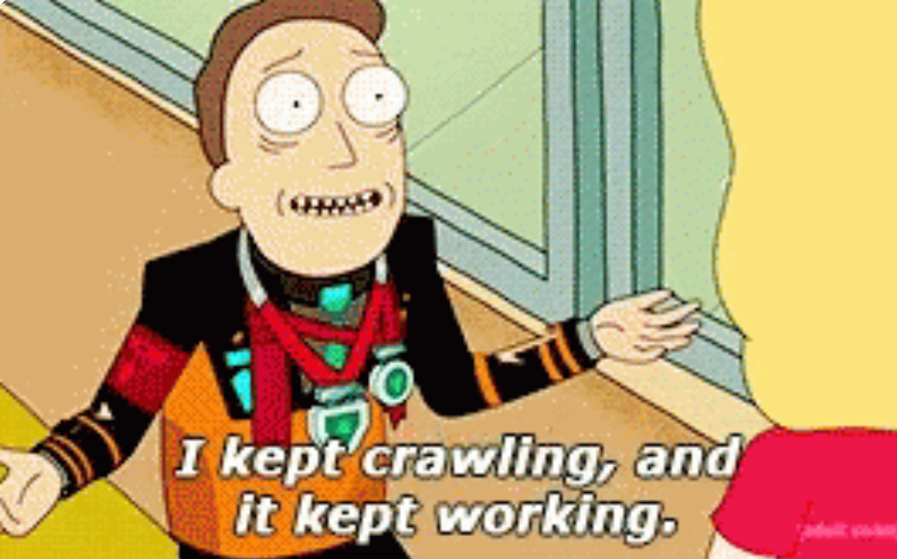
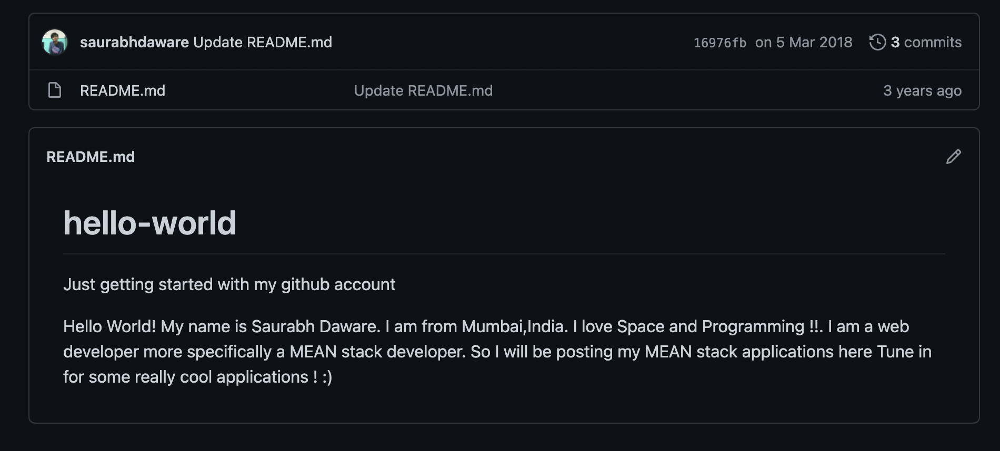
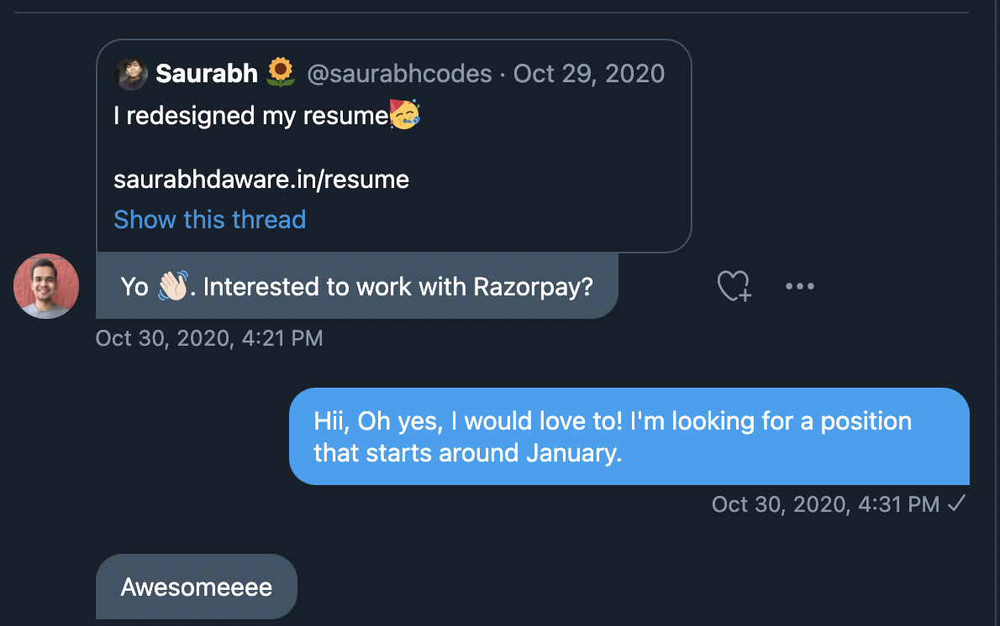

I wish if I could write down step 1, step 2, step 3 to get your first job. Unfortunately, things aren't that certain and a lot of factors play role. So rather than making this article "Do this to get your first job" It's more of a "I did this. Maybe try and see if it works for you?" 

<b>TLDR</b>

## Getting an Interview

It's hard to sum this up in a short article so I'll try to mention some of the highlights that I feel have helped me in eventually getting an interview.

### Year 2016, 2nd Semester of Engineering 

We had a genuinely good professor for programming. She taught us so well that I started liking programming. I had introduction to programming at few instances before but this was pretty much the point where I learnt most of the programming that I know today.

Later started exploring web on my own (tried android -> didn't work on my low-end laptop -> gave up). 

So I started with HTML, CSS, and <s>JavaScript</s> PHP. 

Fun fact: I hated JavaScript!

### Early 2018, Learning JavaScript (not really)

I did an internship on Node.js (Learnt Node.js before Frontend JavaScript lol) and Angular (Again, Before Frontend JavaScript) and was doing another internship on Vue.js. The way I learnt frameworks and languages was a mess but it just eventually worked. 

During this time I decided I am going to create GitHub account and just put my projects there (basically use it as a Google Drive for Projects) and I did!

Here's a picture from my first repository-

*Alt: Hello World! My name is Saurabh Daware. I am from Mumbai, India. I love Space and Programming !!. I am a web developer more specifically a MEAN stack developer. So I will be posting my MEAN stack applications here Tune in for some really cool applications ! :)*

This introduction is very accurate representation of 18-year-old Saurabh.

### Late 2018 - Early 2019, Building Projects

I was building a lot of useless things but they taught me a lot about web and JavaScript in general. Building a boring game (never even released it) helped me learn JavaScript the most. I was very popular on GitHub during this time (no lol). Had 8 stars on all my projects combined and no one really used my projects. Just some of my college friends and my mom.

### Late 2019, Sharing Projects

I was seeing all the cool projects that people were sharing on [dev.to](https://dev.to) and that inspired me to share my projects. Wrote [my first article about my project, PWAinit](https://dev.to/saurabhdaware/turn-existing-website-to-pwa-in-1-minute-using-pwainit-8do) and guess what? I got 7 stars in 2 days! This was more stars than I had received in the last 2 years.

It was nice to see people actually using my project and that inspired me to write more and just then I joined Twitter to share articles!

Basically sharing projects in articles, then sharing articles in tweets hehe.

I met some very kind people on Twitter who gave me shoutouts and helped me throughout and still help whenever I reach out to them.

### Late 2020, Getting the Razorpay Interview

One year of using Twitter and I had met some absolutely amazing people. On a random day, One of those amazing people, [Kamlesh](https://twitter.com/_kamlesh_), reached out to me with this message.

And in next few days, I got a call from the HR 🎉

## Interview Experience

First, there was a call with the HR where we discussed about what I do and my expected day of joining and talked a bit about my projects, past experience, and open-source. I asked few questions around the interview process. 

Soon after the call, I got an email with a schedule to first 2 rounds of the interview.

Round 1 was called "Tech Deep Dive", As soon as I joined the meeting, my internet said "bye ✌🏼". I got extremely nervous and thought I messed up already but the interviewer was extremely patient and suggested to do the round over a phone call instead of Google Meet. So we had a conversation over a phone call. We discussed about my projects. I was surprised to see how much the interviewer had studied my projects. The questions were more of a 'how I implemented a particular thing in my xyz project'. I felt extremely comfortable during this round as it was more of a discussion and less of Q and A. The interviewer was an amazing listener and listened to all my answers carefully. 

Round 2 was The Coding Round, Again we had a little bit of conversation about my projects for few minutes and then we pair programmed on CodeSandbox to play around few things in React. Brushing up my React and JS fundamentals helped during this round. The interviewer was extremely friendly and made me feel comfortable. I even forgot a syntax of something basic in-between and interviewer did realize this without me mentioning. The interviewer also didn't know that syntax so they google searched the syntax for me, and helped me get unstuck on that part. This round too went well and I loved the discussion we had during this round.

Round 3 was a round called "Core JavaScript/Web Fundamentals". Again we had a bit of conversation about my projects and eventually moved to talking about Web and JavaScript in general. This too was more of a discussion and less of a Q and A. We discussed about Frontend Security, and talked about few of the decisions in my projects, and dived deep inside the implementation of few things in my projects. All the questions were related to the job and they were expected questions and nothing came as a surprise.

Round 4 was a conversation with the director. Apart from talking about projects, we discussed things about how I keep myself updated with the new tech, what I like to work on, etc.

Throughout the process, one constant thing that I can't miss mentioning is how friendly the interviewers were. They made me feel comfortable and listened to my answers. Every question they asked was a very valid question and was related to the job. No question came as a surprise and I felt like I was always prepared for this interview. 

You can learn more about what we do and the interview process at [Razorpay's Frontend Jobs Page](https://razorpay.com/jobs-frontend/)

----

## Rough Temp

- Initial call with the HR
- Round 1: **Conversation** || Internet messing things up, Conversation about Abell and older projects (with Nick)
- Round 2: **Coding** || Writing Abell, React JS question
- Round 3: **Fundamentals** || JS Fundamentals, Authentication, Security, Working of Login.
- Round 4: **Discussion with Director** || Again discussing projects. 

So what helped me? 1. People!!, 2. Building and Sharing Projects, 3. Being engaged with the tech community through talks/articles/projects, 4. Luck

Ok let me mention this before we end- This is a very short article so I only highlighted the goods. I really don't want to overwhelm anyone. There have been lots of bads in-between from failing a bunch of interviews, being scared of applying for jobs out of fear of ending up at a wrong place, not getting any response from lots of companies, and covid surprise. Unfortunately it's not always sunflowers and rainbows.