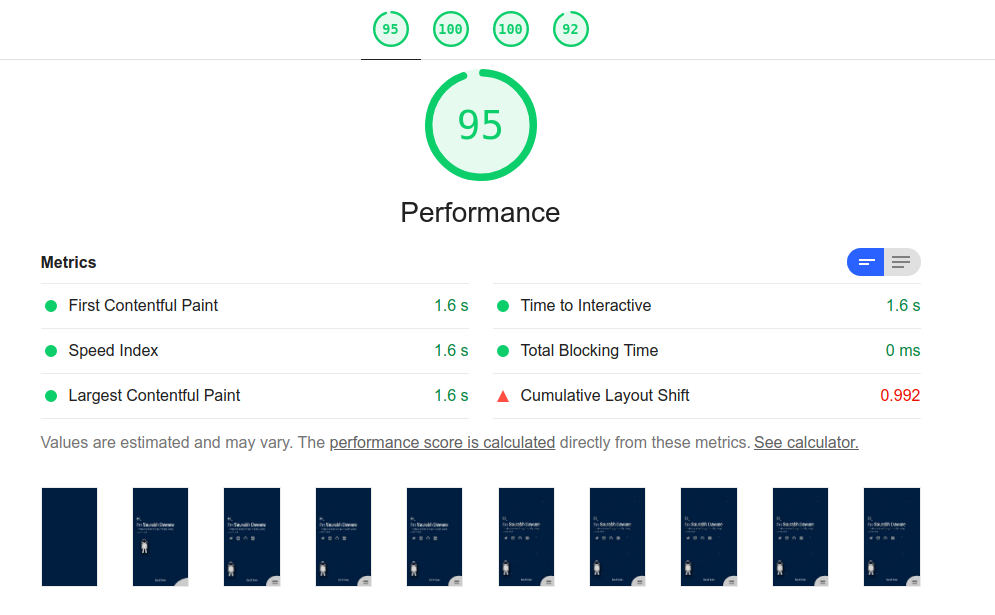
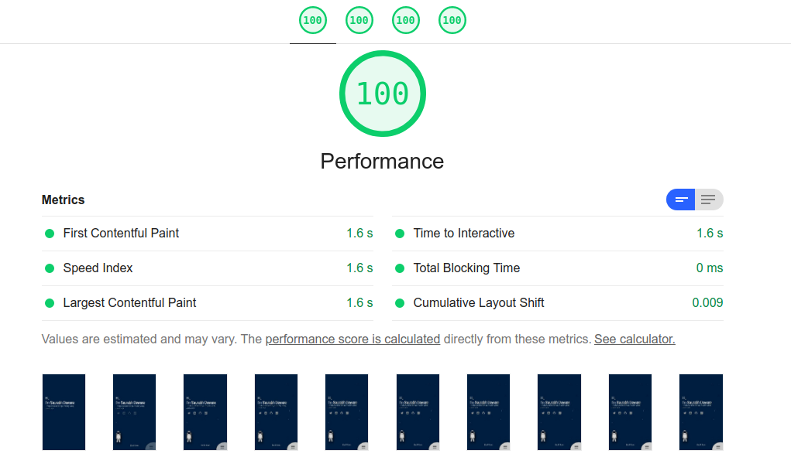

*Note: [WIP] This site is Work In Progress.*

There are lots of articles on the internet mentioning that we lose `x` amount of users when the website is slower than `y` seconds. Then why not we all just start making fast websites? well... its hard. 

After some optimizations like sizing images correctly, minifying the code, we hit a point where the way websites load and parsed become a limitation to further improvements.

## The Parsing Limitation

This is what happens when we visit website from browser-
- User types URL and hits enter
- Server returns the HTML file
- Parsing starts
- Parsing halts at `<link>` tag and waits for stylesheet to load
- Parses loaded css content
- HTML Parsing continues and website is rendered

Thus now the issue is the stylesheet. If the stylesheet is heavy, then the whole website will take time to load. While all this happens, your users see a blank white page.

Can we fix this? yes we can! We can use `rel="preload"` attribute on link to load the stylesheet but let the parser continue while the stylesheet is loading.

```html
<link rel="preload" as="style" href="index.css" onload="this.rel = 'stylesheet'; this.onload = null" />
```

Awesome! We fixed the Parsing Limitation Problem. But hey here's a new problem! 

## FOUC

Since your stylesheet is not loaded and still we let the parser render the rest of the website, Your users will see FOUC (Flash of Unstyled Content). This is how your website will look until the website loads-


**Solution-**

We can identify which styles are required in the initial hero page and add those styles in the parent HTML page inlined in the head tag.
```html
<head>
<style>
  /* important styles required in the beginning of load */
</style>
</head>
```

## The Scalability Issue

This means we have half of our styles in head tag of main page, rest in the stylesheet somewhere. Also, now instead of just not-loaded and loaded state of site now you also have to design and implement the half-loaded state.

This adds up lot of code and messes up the code structure. Oh and have I mentioned that we are just talking about vanilla HTML, CSS, JS sites and haven't even touched the bundlers yet.

Inlining styles is a whole different task with bundlers, here's talk by [Surma](https://twitter.com/dassurma) and [Jake](https://twitter.com/jaffathecake) mentioning the issue-

<br/>
<p style="text-align: left">
<iframe width="560" height="315" src="https://www.youtube.com/embed/TsTt7Tja30Q" frameborder="0" allow="accelerometer; autoplay; clipboard-write; encrypted-media; gyroscope; picture-in-picture" allowfullscreen></iframe>
</p>
<br/>

And thus we eventually hit a condition where we only have one option, either add that extra bit of performance or have a better structured code and ignore the performance improvements.

<br/>


## Solution to this?

This problem was one of the inspirations while building [Abell](https://abelljs.org/). 

**How does Abell tries to solve this issue-**

With the recent [v0.10.0 release](https://github.com/abelljs/abell/releases/tag/v0.10.0), you can now have custom css link rel in the HTML page which allows us preloading styles, deferring scripts, etc. This mixed with the Abell's bundling techniques can allow you to have a scalable + fast website.

With Abell, you can inline styles to head without actually writing them into head.

`components/MyComponent.abell`
```html
<AbellComponent>
<template>
  <!-- HTML Content -->
  <div>Hello, World!</div>
</template>

<style inlined>
  /* Critical styles that go into head tag during build */
  div {
    padding: 10px;
  }
</style>

<style>
  /* 
    Not-so-important styles that can be delayed. 
    Bundled into bundled-css/main.abell.css by default 
  */
  div {
    background-color: #09f;
  }
</style>
</AbellComponent>
```

`index.abell`
```html
\{{
  const MyComponent = require('./components/MyComponent.abell');
}}
<html>
<head>
  <link 
    rel="preload" 
    as="style" 
    href="bundled-css/main.abell.css" 
    onload="this.rel = 'stylesheet'; this.onload = null" 
  />
</head>
<body>
  <MyComponent />
</body>
</html>
```

This allows you to have better code structure and still add that extra performance.

I recently moved my portfolio [saurabhdaware.in](https://saurabhdaware.in) from plain HTML, CSS, JS setup to [Abell](https://abelljs.org) and not only I was able to keep the website performant while improving the code structure, I was able to improve the Cumulative Layout Shift -

### Before



### After



Notice how the site loads the text instead of a blank blue page. This was possible since there was no compromise in the code structure so I could go all in to improving that extra bit of performance.
